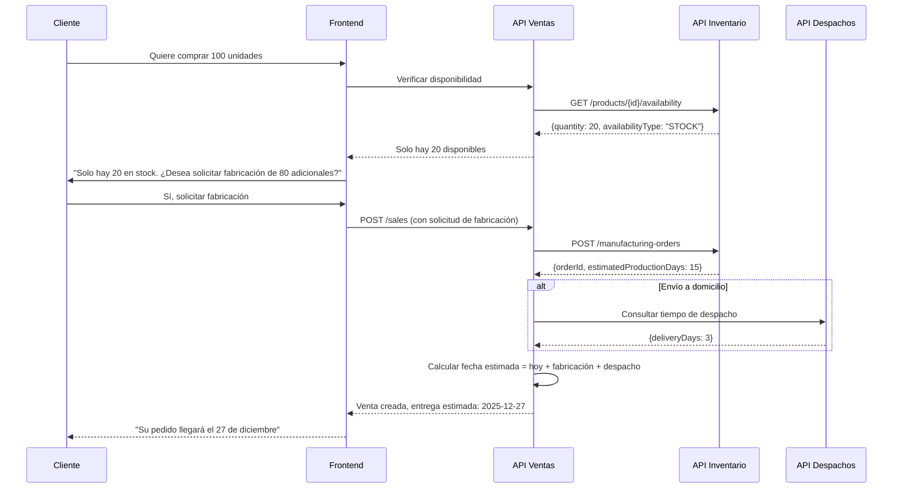
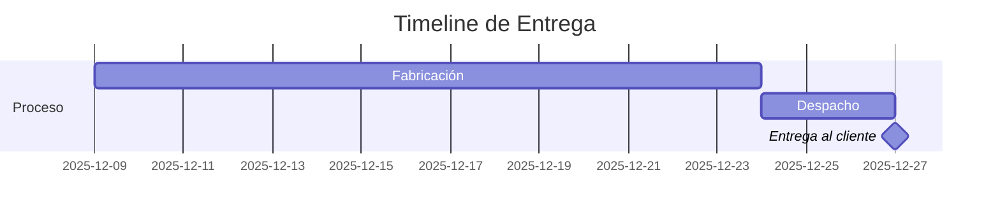

# Caso 6: Producto Sin Stock - Solicitud de Fabricación

**Fecha:** 2025-12-09  
**Contexto:** Manejo de ventas cuando el producto no tiene stock disponible suficiente

---

## Descripción del Escenario

El cliente desea comprar una cantidad de productos que **excede el stock disponible**, o el producto tiene `availabilityType = ON_DEMAND`. En este caso, debemos:

1. Permitir la venta aunque no haya stock
2. Solicitar a Inventario que cree una **orden de fabricación**
3. Recibir una **fecha estimada de entrega** (fabricación + despacho)
4. Informar al cliente la fecha en que recibirá su pedido

---

## Flujo Propuesto



---

## Tipos de Disponibilidad

| Tipo | Descripción | Acción en Ventas |
|------|-------------|------------------|
| `STOCK` | Producto en inventario físico | Venta inmediata, reservar stock |
| `ON_DEMAND` | Producto bajo pedido (siempre requiere fabricación) | Crear orden de fabricación |
| `PRE_ORDER` | Pre-venta (producto no lanzado aún) | Crear orden de fabricación |
| `PARTIAL` | Stock parcial + fabricación del resto | Combinar: reservar lo disponible + fabricar el resto |

---

## Nuevo Endpoint Requerido de Inventario

### `POST /api/v1/manufacturing-orders`

#### Request que ENVIAMOS a Inventario

```json
{
  "productId": "prod-001",
  "quantity": 80,
  "priority": "NORMAL",
  "requestedBy": "SALES_API",
  "metadata": {
    "saleId": "sale-abc123",
    "customerId": "person-xyz789",
    "deliveryMethod": "DISPATCH"
  }
}
```

| Campo | Tipo | Descripción |
|-------|------|-------------|
| `productId` | string | ID del producto a fabricar |
| `quantity` | number | Cantidad requerida |
| `priority` | string | `"HIGH"`, `"NORMAL"`, `"LOW"` |
| `requestedBy` | string | Sistema que solicita |
| `metadata` | object | Datos adicionales de la venta |

#### Response que RECIBIMOS de Inventario

```json
{
  "id": "mfg-order-001",
  "productId": "prod-001",
  "quantity": 80,
  "status": "PENDING",
  "estimatedProductionDays": 15,
  "estimatedCompletionDate": "2025-12-24T00:00:00.000Z",
  "createdAt": "2025-12-09T20:00:00.000Z"
}
```

| Campo | Tipo | Descripción |
|-------|------|-------------|
| `id` | string | ID de la orden de fabricación |
| `status` | string | Estado: `PENDING`, `IN_PROGRESS`, `COMPLETED`, `CANCELLED` |
| `estimatedProductionDays` | number | Días estimados de fabricación |
| `estimatedCompletionDate` | ISO 8601 | Fecha estimada de finalización |

---

## Cálculo de Fecha de Entrega

```
Fecha de Entrega = Fecha Actual + Días de Fabricación + Días de Despacho

Ejemplo:
- Hoy: 9 de diciembre
- Fabricación: 15 días → 24 de diciembre
- Despacho: 3 días → 27 de diciembre
```



---

## Casos Combinados

### Caso A: Todo disponible en stock
```
Pedido: 20 unidades
Stock: 50 unidades
→ Reservar 20 del stock, entrega inmediata (o según despacho)
```

### Caso B: Stock parcial + fabricación
```
Pedido: 100 unidades
Stock: 20 unidades
→ Opción 1: Reservar 20 + fabricar 80 (entrega única cuando todo esté listo)
→ Opción 2: Enviar 20 ahora + 80 después (dos entregas)
```

### Caso C: Sin stock (ON_DEMAND)
```
Pedido: 50 unidades
Stock: 0 unidades (producto ON_DEMAND)
→ Fabricar 50, entrega en fecha estimada
```

---

## Cambios Requeridos en la Interfaz (Frontend)

### 1. Mostrar disponibilidad real

```
┌─────────────────────────────────────────────┐
│ Laptop Dell XPS 13                          │
│ Precio: $1,300.00                           │
│ ────────────────────────────────────────    │
│ ✅ 15 unidades disponibles (envío en 3 días)│
│ 📦 Más unidades bajo pedido (15 días)       │
│                                             │
│ Cantidad: [____] ▼                          │
└─────────────────────────────────────────────┘
```

### 2. Validación flexible de cantidad

```javascript
// ANTES: Bloqueaba si excedía stock
if (quantity > stockQuantity) {
    showError("Stock insuficiente");
}

// DESPUÉS: Permite pero muestra advertencia
if (quantity > stockQuantity) {
    const toManufacture = quantity - stockQuantity;
    showWarning(`${stockQuantity} disponibles ahora. 
                 ${toManufacture} se fabricarán bajo pedido.
                 Tiempo estimado: ${estimatedDays} días adicionales.`);
}
```

### 3. Mostrar fecha estimada antes de confirmar

```
┌─────────────────────────────────────────────┐
│ Resumen de Pedido                           │
│ ────────────────────────────────────────    │
│ 20 × Laptop Dell XPS 13 (stock)             │
│ 80 × Laptop Dell XPS 13 (bajo pedido)       │
│                                             │
│ Total: $130,000.00                          │
│                                             │
│ ⏱️ Entrega estimada: 27 de diciembre 2025   │
│                                             │
│ [Confirmar Pedido]                          │
└─────────────────────────────────────────────┘
```

---

## Datos Adicionales para la Venta

### Schema actualizado de creación de venta

```json
{
  "customer": { ... },
  "items": [
    {
      "productId": "prod-001",
      "quantity": 100,
      "unitPrice": 1300.00,
      "stockQuantity": 20,
      "manufacturingQuantity": 80
    }
  ],
  "deliveryMethod": "DISPATCH",
  "estimatedDeliveryDate": "2025-12-27T00:00:00.000Z",
  "hasManufacturingOrder": true,
  "manufacturingOrderId": "mfg-order-001"
}
```

---

## Respuesta para el Equipo de Inventario

> **Pregunta:** "Qué se debería hacer en la interfaz para mandar a fabricar más cuando los productos disponibles no satisfacen la orden?"

### Respuesta:

Necesitamos que ustedes implementen un nuevo endpoint:

**`POST /api/v1/manufacturing-orders`**

Con este endpoint nosotros les enviamos:
- `productId`: qué producto fabricar
- `quantity`: cuántas unidades
- `priority`: prioridad del pedido
- `metadata`: datos de la venta asociada

Y ustedes nos retornan:
- `id`: ID de la orden de fabricación
- `estimatedProductionDays`: días que toma fabricar
- `estimatedCompletionDate`: fecha exacta de finalización

Con esa información nosotros calculamos la fecha de entrega sumando el tiempo de despacho.

### Flujo simplificado:
```
Cliente pide 100 → Solo hay 20 en stock
↓
Ventas llama POST /manufacturing-orders (80 unidades)
↓
Inventario retorna: {estimatedProductionDays: 15}
↓
Ventas suma días de despacho (ej: 3 días)
↓
Cliente ve: "Entrega estimada: 27 de diciembre"
```

---

## Endpoints Adicionales Sugeridos

| Método | Endpoint | Descripción |
|--------|----------|-------------|
| `POST` | `/api/v1/manufacturing-orders` | Crear orden de fabricación |
| `GET` | `/api/v1/manufacturing-orders/:id` | Consultar estado de orden |
| `DELETE` | `/api/v1/manufacturing-orders/:id` | Cancelar orden (si es posible) |
| `GET` | `/api/v1/products/:id/lead-time` | Obtener tiempo de fabricación estimado |
