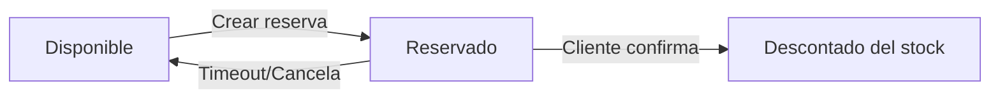
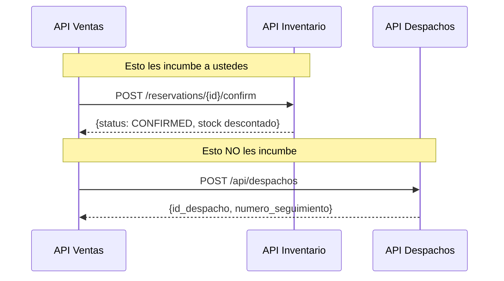

# Respuestas para el Equipo de Inventarios

**Fecha:** 2025-12-09  
**Contexto:** Clarificaciones sobre el flujo de reservas y estados de stock

---

## Pregunta 1: Manejo del tiempo de reserva

> *"Al hacer reserva, ustedes manejarían lo del tiempo, que lo que necesitan es un endpoint para pasar de reservado a disponible los valores, cierto?"*

### Respuesta

✅ **Correcto.** Nosotros manejamos el tiempo de expiración de la reserva (15 minutos). 

Lo que necesitamos de ustedes es:

| Endpoint | Propósito |
|----------|-----------|
| `POST /reservations` | Crear reserva (pasar de disponible → reservado) |
| `POST /reservations/{id}/confirm` | Confirmar compra (descontar del stock definitivamente) |
| `DELETE /reservations/{id}` | Liberar reserva (pasar de reservado → disponible) |

Cuando nuestra reserva expire (timeout de 15 min) o el cliente cancele, nosotros llamamos al `DELETE` para que ustedes pasen esos productos de **reservado → disponible**.

---

## Pregunta 2: PICKUP (Recoger en local) + Reserva

> *"Cuando se selecciona recoger en el local y luego se reserva, los productos se van a reservado. Pero cuando se confirma la compra, estos se descuentan directamente de reservado (Sin pasar por despacho ni nada de eso)"*

### Respuesta

✅ **Exactamente correcto.**

```
PICKUP + PENDING → Reservado
PICKUP + COMPLETED → Descontar de stock (sin despacho)
```



**No hay interacción con API de Despachos** en este caso. Solo necesitamos que ustedes:
1. Al crear reserva: muevan la cantidad a "reservado"  
2. Al confirmar: descuenten del stock total (el producto ya no está ni disponible ni reservado)

---

## Pregunta 3: DISPATCH (Envío a domicilio) + Reserva

> *"Cuando se selecciona la compra online y luego se reserva el producto. Cuando se confirma la compra, ¿qué sucede? ¿Se descuenta de reservado directamente? ¿O se pasa a despacho?"*

### Respuesta

Desde la perspectiva de **inventario**, el comportamiento es **idéntico al PICKUP**:

✅ Se descuenta del stock al confirmar.

```
DISPATCH + PENDING → Reservado
DISPATCH + COMPLETED → Descontar de stock
```

**La diferencia:** Después de confirmar con ustedes (Inventario), **nosotros** hacemos una segunda llamada a la **API de Despachos** para crear la orden de envío. Pero esto es transparente para ustedes.



**Resumen para ustedes (Inventario):**
- No necesitan saber si es PICKUP o DISPATCH
- Solo descuenten del stock cuando les llamemos al `confirm`
- El "despacho" es un proceso aparte que manejamos nosotros con otro equipo

---

## Resumen: Lo que necesitamos de Inventario

| Acción | Endpoint | Qué hacer con el stock |
|--------|----------|------------------------|
| Cliente agrega al carrito | `POST /reservations` | Disponible → Reservado |
| Cliente confirma compra | `POST /reservations/{id}/confirm` | Reservado → Vendido (descontar) |
| Reserva expira o cancela | `DELETE /reservations/{id}` | Reservado → Disponible |

---

## Pregunta adicional para ustedes

¿Necesitan algún dato adicional en las llamadas para diferenciar PICKUP vs DISPATCH? 

De nuestra parte podemos enviarles un campo `deliveryMethod` en el metadata si les sirve para reportes o tracking, pero funcionalmente no debería cambiar el comportamiento del stock.
